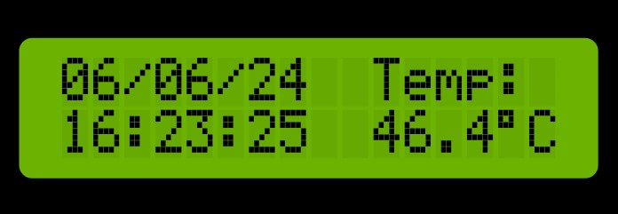
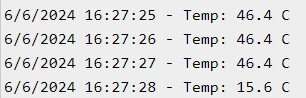
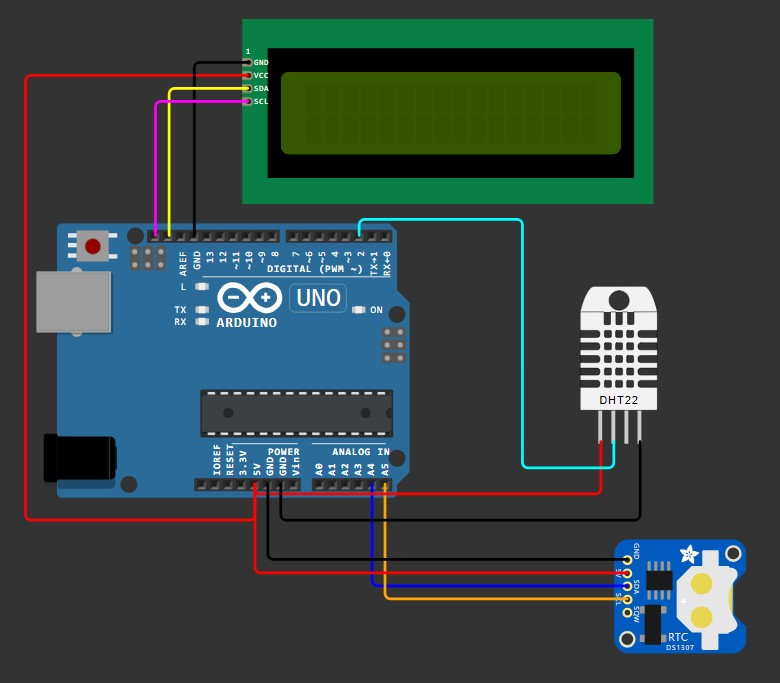

# DISPOSITIVO DE MONITORAMENTO DA QUALIDADE DE ÁGUA

## Blue+:
* Victor Hugo de Paula
* Vítor Rivas Cardoso
* Nicolas Aquino Borges

## Descrição: 
Protótipo de um sistema de captura e visualização de dados sobre a saúde dos oceanos.

## Índice:
- <a href="#funcionalidades">Funcionalidades</a>
- <a href="#simulação">Simulação</a>
- <a href="#hardware">Hardware necessário</a>
- <a href="#bibliotecas">Bibliotecas necessárias</a>
- <a href="#reproduzir">Como reproduzir</a>
- <a href="#roadmap">Roadmap</a>
- <a href="#versoes">Histórico de versões</a>

<h2 id="funcionalidades">Funcionalidades:</h2>

Nesta primeira versão do protótipo, foram implementados: <b>SENSOR DE TEMPERATURA, SINCRONIZAÇÃO COM DATA E HORA.</b>   
No display LCD, essas informações ficam dispostas para consulta, apresentando a média móvel das leituras do DHT (sensor utilizado para leitura de temperatura), à direita, e registro de tempo, à esquerda.
   
  
No terminal, são registradas as leituras sem pré-processamento e também com o registro de tempo.
   

<h2 id="simulacao">Simulação:</h2>

* [Link para simulação](https://wokwi.com/projects/399970115915742209)

<h2 id="hardware">Hardware necessário:</h2>

- Arduino Uno R3 (ou similar)
- Sensor de temperatura digital ou analógico (Foi utilizado o DHT22 neste protótipo)
- Módulo RTC
- Display LCD 16x2
- Cabos jumper macho/macho e macho/fêmea
- Placa de ensaio
- Cabo USB 2.0 A/B

<h2 id="bibliotecas">Bibliotecas necessárias:</h2>

- LiquidCrystal I2C (Para o display)
- RTClib (Para o Real Time Clock)
- DHT sensor library (Para o sensor de temperatura)

<h2 id="reproduzir">Como reproduzir:</h2>

#### 1 - Instale a IDE do Arduino.
- [Link para download](https://support.arduino.cc/hc/en-us/articles/360019833020-Download-and-install-Arduino-IDE)

#### 2 - Conecte os componentes conforme o esquema abaixo:

#### 3 - Conecte o cabo USB 2.0 A/B no Arduino e o USB no computador/notebook. Um LED se acenderá, informando que o Arduino está ligado.

#### 4 - Dentro da IDE, clique em ferramentas, selecione o tipo de Arduino e veja se o computador o reconhece, na seleção "Port".

#### 5 - Crie um novo arquivo e insira o código:
- [Código](./code.ino)

#### 6 - Após colado, certifique-se de instalar as bibliotecas referenciadas no começo do documento e clique na seta para enviar o código.

#### 7 - Aguarde a compilação e envio do programa.

<h2 id="roadmap">Roadmap:</h2>

- Implementação de novos sensores, como: Sensor de condutividade elétrica; Eletrodo de pH; Sensor óptico ou eletroquímico de oxigênio dissolvido; Sensor de turbidez (sensor baseado em luz dispersa); Sensores específicos para cada poluente, como sensores de metais pesados, pesticidas e hidrocarbonetos.
- Implementação de dispositivos de referenciamento geográfico.
- Integração do dispositivo com uma plataforma online para armazenamento de dados em nuvem.
- Utilização de ferramentas inteligentes que facilitem a visualização dos dados capturados.

<h2 id="versoes">Histórico de versões:</h2>

- **v0.1** (07/06/2024): Datalogging e registro de temperatura.
